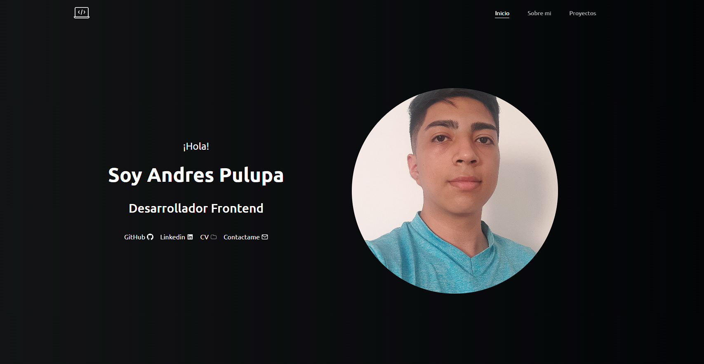

# Portafolio

## Descripción general

### Funcionalidades

- La aplicación puede ser vista de manera optima según el tamaño de pantalla de su dispositivo
- En dispositivos móviles la barra de navegación es desplazable.
- Ver mis habilidades y proyectos donde pueden visitar el repositorio o la web.

## Screenshot

## Link

- URL del Sitio: [Andres Pulupa - Portafolio](https://andres-pulupa-portafolio.vercel.app/)

## Mi proceso

## Construida con

- HTML 5
- CSS
- Flexbox
- CSS Grid
- Animate CSS
- Mobile-first
- Tailwind
- React Js
- React Icons
- React Intersection Observer

## Contactame
- Linkedin - [Andres Pulupa](https://www.linkedin.com/in/andres-pulupa/)
